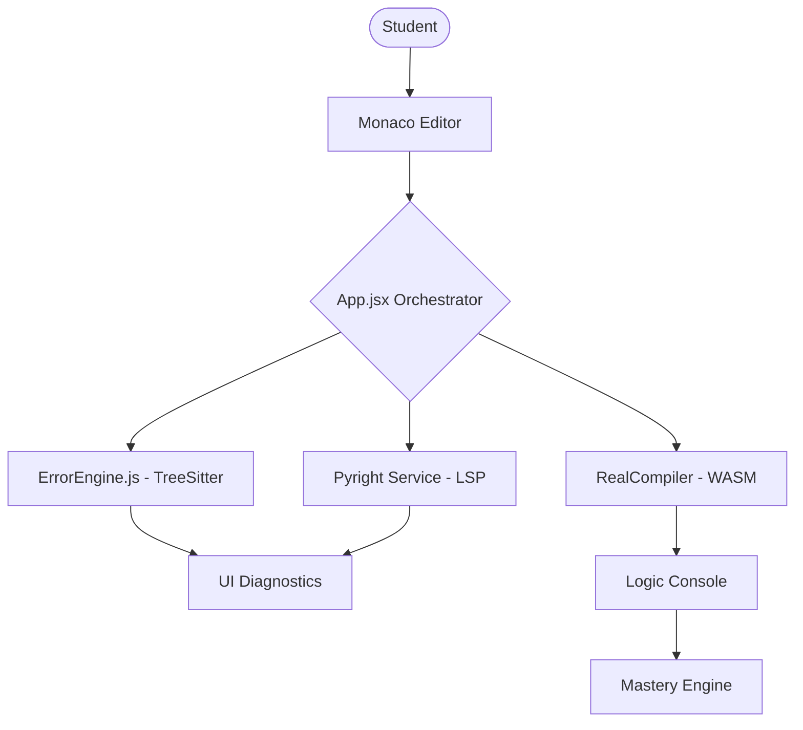

# Architecture Blueprint: Logic Lens Pro

Logic Lens Pro is a **pedagogical compiler environment** designed to eliminate "vibe coding" by forcing deep understanding through real-time static analysis and Socratic guidance.

## System Overview
The system is built on a distributed architecture where the frontend (React) manages the user interface and local parsing, while a dedicated Node.js service handles heavy-duty static analysis via Pyright.

## Technology Stack
- **Core UI**: React.js + Vite (High-performance rendering)
- **Code Editor**: Monaco Editor (The same engine powering VS Code)
- **Static Analysis**: Pyright (Microsoft's professional-grade type checker)
- **Execution**: Pyodide (Full Python interpreter running in the browser WASM)
- **Styling**: Vanilla CSS with Glassmorphism aesthetics
- **State Management**: React State + Context for pedagogical tracking

## Component Communication Map

## Data Flow: From Keystroke to Hint
1. **Input**: Student types code in `Monaco Editor`.
2. **Detection**: `App.jsx` listens for changes and debounces the signal.
3. **Analysis**:
   - **Local**: `ErrorEngine.js` uses Tree-sitter for immediate syntax/indentation checks.
   - **Remote**: `pyright-service.cjs` provides deep semantic analysis (undefined variables, type errors).
4. **Pedagogy**: `HintEngine.js` maps raw errors to **Learning Concepts**.
5. **Feedback**: The UI renders squiggles, tooltips, and Socratic hints.
