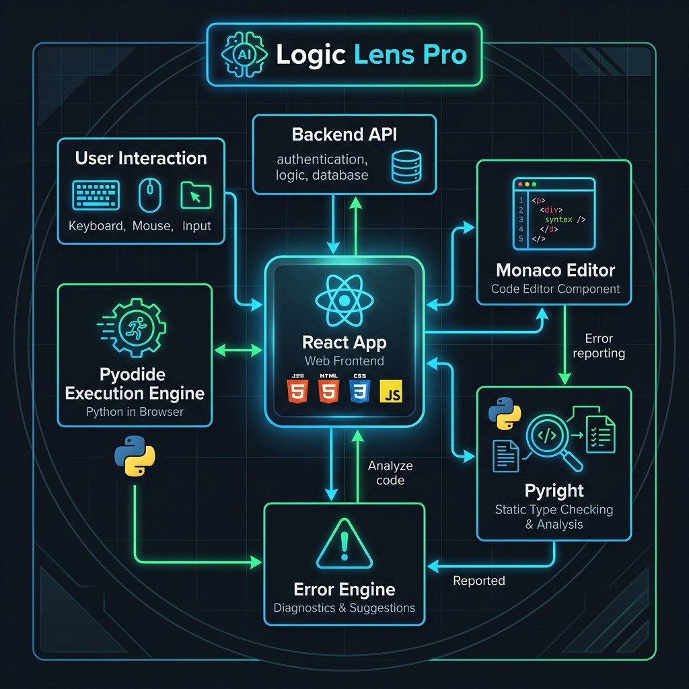
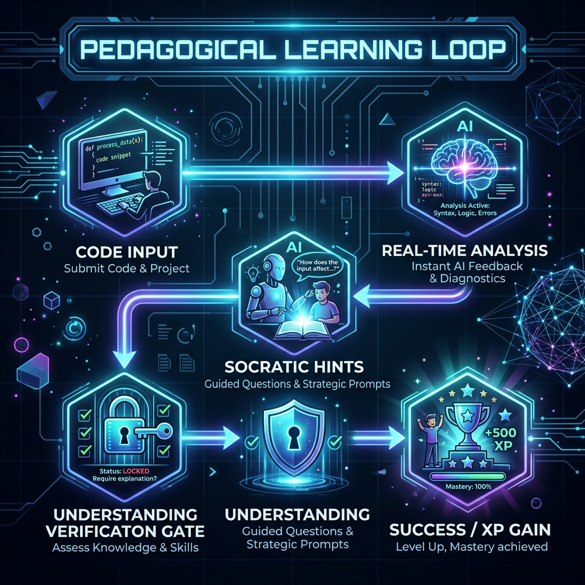

# Visual Diagrams & Layouts

This document contains high-level visual representations of Logic Lens Pro.

## System Architecture



## The Learning Loop (Pedagogy)



## UI Layout Blueprint (ASCII)

```text
┌───────────────────────────────────────────────────────────┐
│ [Flame] LOGIC LENS PRO         [PY ENGINE] [PYRIGHT] [AI] │
├───────────────┬───────────────────────────┬───────────────┤
│               │                           │               │
│ MISSION       │   MONACO EDITOR           │  LOGIC        │
│ CONTROL       │                           │  CONSOLE      │
│ (Requirement) │   - Real-time Squiggles   │  (Output)     │
│               │   - Auto-complete         │               │
│               │                           │               │
├───────────────┤                           ├───────────────┤
│               │                           │               │
│ SOCRATIC      │                           │  AI LOGIC     │
│ GUIDANCE      │   [ EXECUTE LOGIC ]       │  MENTOR       │
│ (Hints)       │                           │  (Chat)       │
│               │                           │               │
├───────────────┤                           ├───────────────┤
│               │                           │               │
│ MASTERY       │                           │  HISTORY      │
│ PROGRESS      │                           │               │
│ (XP Bar)      │                           │               │
└───────────────┴───────────────────────────┴───────────────┘
```

## Data Transformation Pipeline

1. **RAW CODE** (String)
2. **AST** (Abstract Syntax Tree via Tree-sitter)
3. **DIAGNOSTICS** (JSON Errors from Pyright)
4. **PEDAGOGICAL WRAPPER** (Mapping Errors to Concept IDs)
5. **UI CARDS** (Visual Hints & Challenges)
